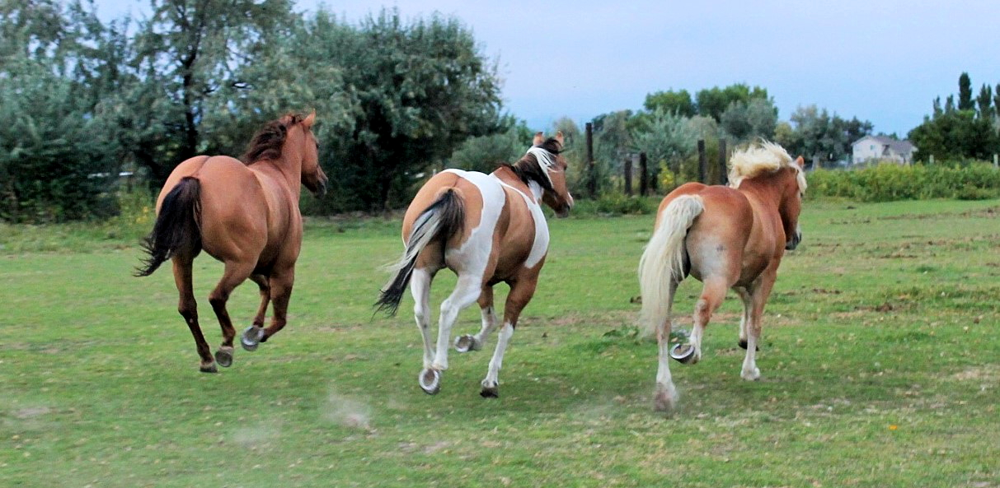

<DOCTYPE html>
<html>
  <head>
    
    <title>Call It Photography</title>
    <link rel="stylesheet" type="text/css" href="Style.css">
    
    
    
    
    
  </head>
  <body id="mainContainer" class="fade-out">
    <main>
      
    <h1 id="large">
    <h2>Introduction</h2>
    
Call It Photography is a company made to help people who have disabilities or problems mentally.  We strive
    to find out why the brain is working the way it is, and want to learn how we can better fix it.

    
    
     
     
    Since there are so many different opinions on the different subjects of the brain
    we feel it's important to post an article written by one of our own:
     
     
    <a class="center" id="large" href="How Psychotherapy Changes the Brain.docx">How Psychotherapy Changes the Brain</a>
       
    <button type="button" onclick="document.querySelector('#mainContainer').style.backgroundColor = 'orange'">Change the page</button>
     
    
    <h3>My Pictures</h3>
    

      
    

    
This whole section other than the headers was done using Canvas API, here's where I learned how:
    <a href="https://developer.mozilla.org/en-US/docs/Web/API/Canvas_API/Tutorial/Drawing_shapes">Drawing shapes</a>
    

     
    
    <h1>End Of Page</h1>
    
If you really want to go to the next page just make sure you click on the link for page 2.
    The "Home Directory" link will bring you back to the original page, and the "Week 03 Team assignment" will bring
    you do the team activity for this week.

    
    <a class="page2" href="FunPage.html">Continue to page 2 >> </a>
    

    <a href="../index.html">Home Directory</a>
     
    </main>
  </body>
</html>
